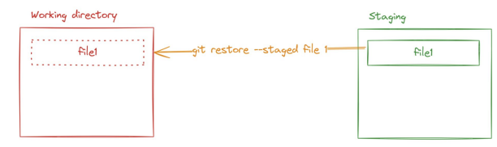
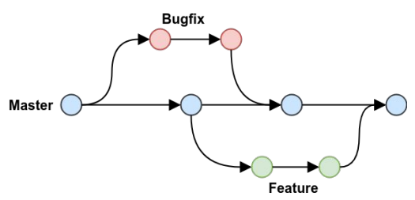

## 🎓 **Lesson 03 - Git & JavaScript**
🔧 **GIT - Nâng cao với GitHub**

- **Thay đổi nội dung commit gần nhất**
    
    ```bash
    git commit --amend
    ```
    
- **Quy trình:**
    - Gõ `i` → Vào chế độ chỉnh sửa
    - Nhấn `Esc` để thoát
    - Gõ `:wq` → Lưu và thoát
    
    💡 Có thể dùng nhanh hơn:
    

```bash
git commit --amend -m "New message"
```

---

### ♻️ **Hoàn tác các thay đổi**

- **Từ Staging → Working Directory**
    
    ```bash
    git restore --staged <file>
    ```
    

👉 Trả file về trạng thái trước khi add



- **Từ Repository → Working Directory (Undo commit)**
    
    ```bash
    //Hoàn tác 1 commit gần nhất
    git reset HEAD~1
    
    //Hoàn tác 3 commit gần nhất
    git reset HEAD~3
    ```
    

    
    

---

### 🌿 **Branch - Làm việc với nhánh**

| Lệnh | Chức năng |
| --- | --- |
| `git branch <tên_nhánh>` | 🏗️ Tạo nhánh mới |
| `git checkout <tên_nhánh>` | 🔁 Chuyển sang nhánh |
| `git checkout -b <tên_nhánh>` | ⚡ Tạo và chuyển sang nhánh mới |


🧠 Nhánh giúp làm việc độc lập, tránh ảnh hưởng tới **main**

---

### 🚫 **Loại trừ file khỏi commit**

Sử dụng file **`.gitignore`** để **bỏ qua file/thư mục**:

```
# Bỏ qua file cụ thể
secret.txt

# Bỏ qua cả thư mục
node_modules/
```

---

### ✨ **JAVASCRIPT - Tổng quan nâng cao**
📚 **Quy tắc đặt tên (Conventions)**

- snake_case_now_now
- kebab-case-now-now
- camelCaseNowNow
- PascalCaseNowNow

### 🔀 **Cấu trúc điều kiện & vòng lặp**

### 📍 **Câu lệnh điều kiện:**

```jsx
if (condition) {
  // Code khi điều kiện đúng
} else if (otherCondition) {
  // Code khi điều kiện khác đúng
} else {
  // Code khi không có điều kiện nào đúng

```

🔘 **Switch case:**

```jsx
switch (value) {
  case 'A':
    // Code cho A
    break;
  case 'B':
    // Code cho B
    break;
  default:
    // Code mặc định
}
```

---

### 🔁 **Vòng lặp:**

📌 **For loop:**

```jsx
for (let i = 0; i < 5; i++) {
  console.log(i);
}
```

📌 **While loop:**

```jsx
let i = 0;
while (i < 5) {
  console.log(i);
  i++;
}
```

📌 **Do...while loop:**

```jsx
let i = 0;
do {
  console.log(i);
  i++;
} while (i < 5);
```